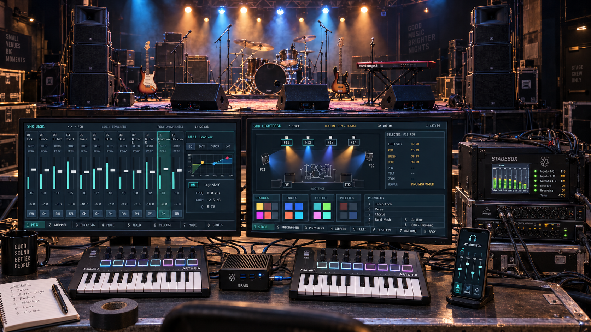

<div align="center">



**Audio console · Lighting console · Performer monitors · Multitrack recording**

[](https://github.com/PaolaShultz/gigpies/actions/workflows/ci.yml)
[](CHANGELOG.md)
[](rust-toolchain.toml)
[](LICENSE)
[](docs/STATUS.md)

[**Start here**](#run-the-cli) · [**Architecture**](docs/architecture/ARCHITECTURE.md) · [**Roadmap**](docs/STATUS.md) · [**Documentation**](docs/README.md)

</div>

## Audio and light. Two consoles. One system.

GigPies is an experimental live-band sound and lighting system built in **Rust for Raspberry Pi**.
Version **0.2.3** brings together offline processing, transport and qualified stereo
USB bench work, with the dual-console integration plan. The complete live system
is still in development. [The integration plan](docs/development/MODULE_IMPLEMENTATION_PLAN.md)
owns active tasks and their implementation progress. Its intended live core needs no Internet or external AI service.

GigPies is the complete system, with human-operated audio and lighting consoles.
Automation is one operating mode within those consoles. The vision combines
mixing, PA management, independent performer monitors, lighting and recording.
In MANUAL, the operator runs the show; ASSIST proposes changes; AUTO acts only
within explicitly granted scopes. Soundcheck can prepare a baseline, while
human control remains available independently of automation.

The hero is an AI-generated, photorealistic visualization of the intended operator
setup and stage, with both digital desks, the separate processing node and phone control.
The [original concept artwork](docs/archive/studies/CONCEPT_REVIEW.md) is retained as a historical reference.

## Two nodes. Clear responsibilities.


| Stagebox / Mixer | Brain / Show |
|---|---|
| Owns Stagebox audio I/O and the processing reference clock | Owns one local duplex card for talkback and operator listening |
| Runs channel DSP, monitors, PA protection and local NVMe recording | Hosts audio/lighting consoles, richer FX and analysis |
| Applies validated settings and local protection | Sends bounded parameter updates |

Brain local capture/playback has its own device clock. Talkback and operator
monitoring cross through independent asynchronous sample-rate bridges; FX and
raw analysis retain Stagebox source-frame identities. See the
[Brain audio integration](docs/reference/BRAIN_AUDIO.md) for implementation and acceptance status.

These boundaries passed integrated software acceptance at 16/32/48 inputs and
under the declared restart/stall scenarios. Physical qualification is separate. The qualified stereo
bench exercises a narrower audio path. See [architecture](docs/architecture/ARCHITECTURE.md).
The [dual-console Brain](docs/architecture/BRAIN_CONSOLES.md) pairs **two 1920×1080 monitors
and two MIDI keyboard controllers**: SHR Desk for audio and SHR Lightdesk for
lighting, both on one Brain. Both surfaces now have optional native frontends over
real local provider clients, checked with offscreen CPU rendering and injected
role descriptors. Actual dual displays, controllers and physical outputs remain
unverified. SHR Lux owns lighting authority and output; the small display serves
the PA unit.

## Working today

The [configurable engine](docs/reference/MODULAR_PROCESSING.md) combines channel
EQ and compression, flexible monitor sends, SHR PA processing, source-clock SHR FX
and raw SHR REC. Authenticated control supports reviewed routing and PA changes,
live master EQ, measurement proposals and remote FX edits.

[Brain audio](docs/reference/BRAIN_AUDIO.md) provides duplex talkback and operator
listening through independent clock bridges. Desk and Lightdesk have native
frontends over real provider clients. Software validation includes 16/32/48-input
configurations; physical mapping, clock lock, displays/controllers and acoustic
qualification remain separate. See [product status](docs/STATUS.md) and
[acceptance](docs/acceptance/README.md) for scope and limitations.

The [offline automixer](docs/guides/AUTOMIX.md) measures soundcheck material, freezes
editable settings and renders stereo mixes. Additional tools support bounded
balance and tone proposals, artistic effects, EQ matching and true-peak delivery.
[Source preservation](docs/guides/SOURCE_PRESERVATION.md) keeps unchanged audio
eligible when there is no supported reason to alter it. Musical preference requires
listening.

## Run the CLI

Install Rust through rustup. This checkout selects **Rust 1.97.1**.

```sh
git clone https://github.com/PaolaShultz/gigpies.git
cd gigpies
cargo build --locked
cargo run --locked -- --help
cargo run --locked -- inspect /path/to/multitrack-folder
```

Inspection prints JSON channel counts, sample rates, bit depths, frame counts and
durations for one WAV or a flat directory. It reads headers only and leaves source
files unchanged. It opens no audio hardware. Invalid inputs return a nonzero status.

## From recordings to a mix

Use local multitrack WAVs with the [offline mixing guide](docs/guides/AUTOMIX.md).
Source recordings, private sessions and generated audio remain local and are not
distributed with GigPies. See [local media](docs/development/LOCAL_MEDIA.md) for layout.

## Explore the project

| | |
|---|---|
| [**Architecture**](docs/architecture/ARCHITECTURE.md) | Audio ownership, node responsibilities and timing |
| [**Brain consoles**](docs/architecture/BRAIN_CONSOLES.md) | Audio Desk, lighting Lightdesk, two displays/controllers and engine boundaries |
| [**Status & next steps**](docs/STATUS.md) | Implemented behavior and the gradual build sequence |
| [**Existing components**](docs/architecture/COMPONENTS.md) | SHR PA, FX, DAW, lighting and library choices |
| [**Development**](docs/development/DEVELOPMENT.md) | Build, validation, directories and contribution workflow |
| [**Original blueprint**](docs/archive/blueprints/blueprint-v2.md) | Preserved draft with the broader venue vision |
| [**Release notes**](CHANGELOG.md) | What each public version actually delivers |

---

<div align="center">

**Small venues. Sound and light. People in control.**

[MIT code](LICENSE) · [Artwork & third-party notes](THIRD_PARTY.md) · [Report an issue](https://github.com/PaolaShultz/gigpies/issues)

</div>

The configurable modular processing increment is documented in
[Modular processing](docs/reference/MODULAR_PROCESSING.md), including independent strip,
USB/socket and output-patch maps, owner-native configurable PA, shared clock
recovery and [authenticated Brain endpoints](docs/reference/REMOTE_PROCESSING.md).
[Acceptance](docs/acceptance/MODULAR_ENGINE_ACCEPTANCE.md) distinguishes software results from
physical UMC1820/ADA8200 mapping, lock and deadline qualification. The reference
16-input/18-output patch starts unassigned; 32/48-input software profiles are not
product limits.
