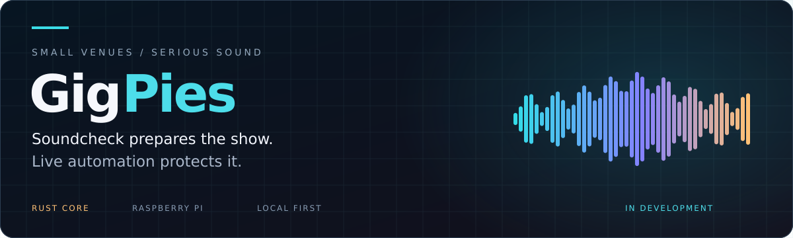
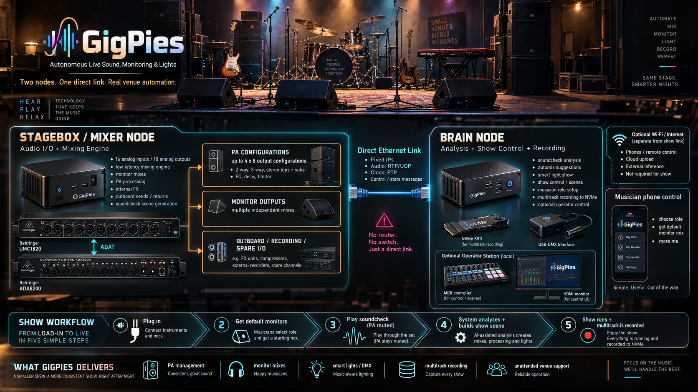
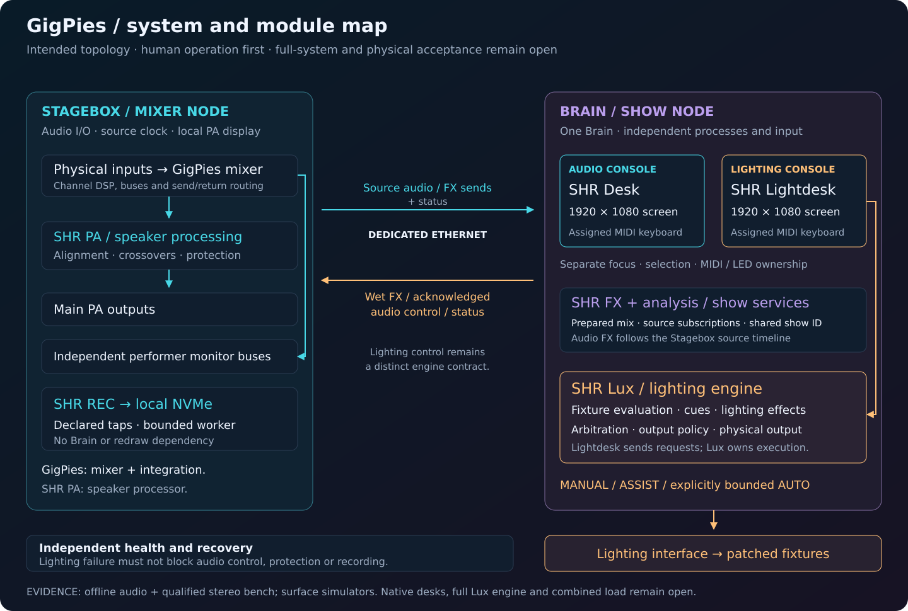

<div align="center">



**Live sound · Performer monitors · Music-aware lights · Multitrack recording**

[](https://github.com/PaolaShultz/gigpies/actions/workflows/ci.yml)
[](https://github.com/PaolaShultz/gigpies/releases)
[](rust-toolchain.toml)
[](LICENSE)
[](docs/STATUS.md)

[**Start here**](#run-the-cli) · [**Architecture**](docs/ARCHITECTURE.md) · [**Roadmap**](docs/STATUS.md) · [**Documentation**](docs/README.md)

</div>

## A prepared show. Room to perform.

GigPies is an experimental live-band sound system built in **Rust for Raspberry Pi**.
Soundcheck prepares a baseline mix. During the show, deterministic rules make bounded
corrections when meaningful exceptions occur. The live core needs no Internet or
external AI service.

The vision combines mixing, PA management, independent performer monitors, lighting
and recording. We are building it **part by part**, starting with automixing experiments
on real band multitracks.



*Supplied AI-generated concept artwork. Device drawings and some labels are inaccurate;
read the [concept review](docs/CONCEPT_REVIEW.md). This image depicts the intended system.*

## Two nodes. Clear responsibilities.



| Stagebox / Mixer | Brain / Show |
|---|---|
| Owns audio I/O and the local signal path | Analyzes soundcheck and prepares mix settings |
| Runs channel DSP, FX, monitors and PA processing | Coordinates recording, lighting and show controls |
| Applies validated settings and local protection | Sends bounded parameter updates |

These are design boundaries. Node integration is planned; see [architecture](docs/ARCHITECTURE.md).

## Working today

The first offline automixer now provides causal soundcheck, editable instrument
presets, frozen settings and full-song stereo rendering. A new unity-source workflow
keeps source gains intact and exports comparisons without loudness matching.
It builds independently and opens no audio hardware. Mix quality awaits listening.

[**Unity-source comparison →**](docs/UNITY_PASS.md) · [**Run the offline automixer →**](docs/AUTOMIX.md) · [**Effects and automatic review →**](docs/FX_PASS.md)

Live-show transport, monitors, lighting and hardware integration remain planned.
[The component map](docs/COMPONENTS.md) records the related developing SHR projects.

## Run the CLI

Install Rust through rustup. This checkout selects **Rust 1.97.1**.

```sh
git clone https://github.com/PaolaShultz/gigpies.git
cd gigpies
cargo build --locked
cargo run --locked -- --help
cargo run --locked -- inspect /path/to/multitrack-folder
```

Inspection prints JSON channel counts, sample rates, bit depths, frame counts and
durations for one WAV or a flat directory. It reads headers only and leaves source
files unchanged. It opens no audio hardware. Invalid inputs return a nonzero status.

## From recordings to a mix

Our first local session is **The Complainiacs — Etc**: 13 original WAV tracks with
drums, bass DI/amp, guitars and vocals. **Dark Ride — Hammer Down** provides a larger
40-track session for later experiments. Both are local educational material; no music
is distributed here. [Source notes and local layout →](docs/MULTITRACKS.md)

The first loop is simple: **inspect → measure → balance → listen → refine**.
Each step should produce something we can assess before adding the next layer.

## Explore the project

| | |
|---|---|
| [**Architecture**](docs/ARCHITECTURE.md) | Audio ownership, node responsibilities and timing |
| [**Status & next steps**](docs/STATUS.md) | Implemented behavior and the gradual build sequence |
| [**Existing components**](docs/COMPONENTS.md) | SHR PA, FX, DAW, lighting and library choices |
| [**Development**](docs/DEVELOPMENT.md) | Build, validation, directories and contribution workflow |
| [**Original blueprint**](docs/archive/blueprints/blueprint-v2.md) | Preserved draft with the broader venue vision |
| [**Release notes**](CHANGELOG.md) | What each public version actually delivers |

---

<div align="center">

**Small venues. Prepared sound. Musicians in control.**

[MIT code](LICENSE) · [Artwork & third-party notes](THIRD_PARTY.md) · [Report an issue](https://github.com/PaolaShultz/gigpies/issues)

</div>
