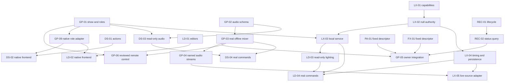

# Module implementation map

Planning checkpoint **2026-10-04, GP-2026-10-04.1**. Twelve owning plans are written;
the original planning inventory is retained below. Implementation is now active;
see the execution checkpoint at the end. Begin with this index, [contracts](../reference/MODULE_CONTRACTS.md)
and [parallel launch cards](plans/PARALLEL_WORK_PLAN.md). Product ownership remains
[COMPONENTS.md](../architecture/COMPONENTS.md); this map records executable increments, not another
product architecture. Source evidence was checked against actual code and owner docs.

GigPies is the complete system: manual audio and lighting consoles, with ASSIST/AUTO
as optional modes. Two 1920×1080 displays and two separately assigned controllers
are the intended Brain layout. Stagebox keeps essential audio, monitor paths,
protection and recording independent of lighting/Brain failures. Development host
roles do not decide the eventual Stagebox/Brain assignment.

## Owning plans and exact inspected baselines

A READY task is software-ready; source delivery, file ownership and build reservation
are still checked at launch. No row implies new hardware verification. All baseline
observations are dated, not an instruction to reset a checkout to an old revision.

| Repository / classification | Owning plan and first task | Inspected HEAD / caveat |
|---|---|---|
| `gigpies` — Core integration / mixer host | [Plan](plans/MODULE_IMPLEMENTATION_PLAN.md); **GP-01** | `99eb0f08050a9a86039af9f1ba2a3541649ca7b6`; existing index edit and untracked planning prompt retained |
| `shr-desk` — Core audio surface | [Plan](https://github.com/PaolaShultz/shr-desk/blob/main/docs/GIGPIES_IMPLEMENTATION.md); **DS-01** | `UNBORN; 25 original untracked source/doc files`; hash-manifest handoff required |
| `shr-lightdesk` — Core lighting surface | [Plan](https://github.com/PaolaShultz/shr-lightdesk/blob/main/docs/GIGPIES_IMPLEMENTATION.md); **LD-01** | `94402b42aae434a158657b7de9a73f013e27e352`; clean before plan writes |
| `shr-lux` — Core lighting engine | [Plan](https://github.com/PaolaShultz/shr-lux/blob/main/docs/notes/0027-gigpies-implementation.md); **LX-01** | `ba4ccd92656e6d2a3cbc6424cdc2a017d3e4f14d`; clean before plan writes |
| `shr-rec` — Core local recorder | [Plan](https://github.com/PaolaShultz/shr-rec/blob/main/docs/GIGPIES_IMPLEMENTATION.md); **REC-01** | `c0416d286eef2a455201dce4e992d9b3f6418f52`; clean before plan writes |
| `shr-fx` — Core wet-effects module | [Plan](https://github.com/PaolaShultz/shr-fx/blob/main/docs/GIGPIES_IMPLEMENTATION.md); **FX-01** | `cd943c6a5cbe3c06be4e9968f54f685e97baf84f`; clean before plan writes |
| `shr-pa` — Core speaker processor | [Plan](https://github.com/PaolaShultz/shr-pa/blob/main/docs/GIGPIES_IMPLEMENTATION.md); **PA-01** | `7683f9b38e2452e904468be3b90306ea450618ee`; clean before plan writes |
| `shr-daw` — Reference only | [Plan](https://github.com/PaolaShultz/shr-daw/blob/main/docs/GIGPIES_IMPLEMENTATION.md); **NONE (DEFERRED)** | `d93447d1ae391e7910c54965f886ed39baedab1c`; clean before plan writes |
| `shr-drums` — Optional source; DEFERRED | [Plan](https://github.com/PaolaShultz/shr-drums/blob/main/docs/plans/GIGPIES_IMPLEMENTATION.md); **NONE (DEFERRED)** | `f4a9a6a09e33f48aba11d77b9089cea03ec08460`; clean before plan writes |
| `shr-synth` — Optional source; DEFERRED | [Plan](https://github.com/PaolaShultz/shr-synth/blob/main/docs/superpowers/plans/2026-10-04-gigpies-integration.md); **NONE (DEFERRED)** | `818c94964334e9db183d136397b43d6461884f83`; clean before plan writes |
| `shr-sampler` — Optional source; DEFERRED | [Plan](https://github.com/PaolaShultz/shr-sampler/blob/main/docs/plans/GIGPIES_IMPLEMENTATION.md); **NONE (DEFERRED)** | `3aaabd50288a54e851618e1c464429a0dbab73eb`; clean before plan writes |
| `shr-tone-over-9000` — Optional source; DEFERRED | [Plan](https://github.com/PaolaShultz/shr-tone-over-9000/blob/main/docs/plans/GIGPIES_IMPLEMENTATION.md); **NONE (DEFERRED)** | `3fec963b88777278413412625fe7cf09b8c77bef`; clean before plan writes |

Each plan records source symbols, owning docs, implemented/mock/missing behavior,
ordered tasks, exact provider contracts, normal/optional test commands, failure
cases, resource class and its implementation prompt. Plans link from each owner's
current index/status/plan. Lux uses next notebook note **0027**, preserving its
numbered convention; Synth uses its existing superpowers/plans convention. Broader
blueprints, original idea documents and historical evidence were retained unchanged
apart from small discovery pointers; no owning draft was replaced.

The Desk baseline is an uncommitted independently buildable project, not an empty
repository to recreate. Its initial file-manifest SHA-256 is
`3d6be3b9d32f26a0c3da36b4117132523b3f4612b181a0b2571bde43b8620258`.
The exact peer source-and-plan snapshot carries its own full file hashes, including
these plans. A synthetic clone baseline is not an upstream commit.

## Inventory conclusions

| Module group | Actual evidence and boundary |
|---|---|
| GigPies | Offline f64 renderer and GPA1/control prototype plus integrated stereo PA/FX/REC host. The GPC1 scalar is not a mixer API; live multichannel graph/roles/show contract remain planned. |
| Desk / Lightdesk | Independently buildable surface simulators, controller primitives and SVG layouts; neither native window nor production engine adapter. They can implement focus/actions independently now. |
| Lux | Recorded four-source analysis, direction and pad previews; pure uDMX encoding. Fixture/programmer/cue authority, timing, persistence and physical DMX remain missing. Null-output authority is the first engine milestone. |
| PA | Full 2×6 standalone DSP with prepared controls; fixed-v1 full-range embedding only. Configurable embedding and phase measurement remain owner work. No complete band mixer here. |
| FX | Two standalone wet racks exist; embedded f64 ABI exposes one fixed delay. Descriptor must not advertise rack functionality through fixed v1. |
| REC | Bounded raw PCM24/recovery worker integrated in bench; shell capture/player unwired. Operation identity and written-progress query are useful next integration work. |
| DAW | Actual consumer of Git-pinned Drums and managed Synth/Sampler. It is a reference for GigPies, not a new mandatory host or mixed ownership of its mixer. |
| Drums / Synth / Sampler / Tone | Working separate engines/hosts with their own contracts. No immediate GigPies consumer; each has a small activation plan and no invented first-wave implementation. |

No currently required supporting-runtime library was discovered beyond the core
modules and their existing locked dependencies. Existing intra-repository workspace
paths are not sibling path dependencies. Rust 1.97.1 is selected explicitly;
Drums has no toolchain pin and some reference/optional repos retain edition 2021.
This documentation pass does not change their versions or editions.

Excluded from product-engine plans: `waves` is the private shared media library;
`shr-skills` is development workflow material; `gigpies-exchange` and the ignored
node-lab hub are development coordination, not runtime transport; legacy aliases
are not separate modules; nested Tone3000/NAM vendor references belong to Tone and
are not new GigPies engines. `go` is a standalone gadget launcher, outside the
COMPONENTS runtime map and not required to start either desk. No private media,
credential tree, build cache or whole workspace is a source handoff.

## Dependency order

Wave 1 has four independent roots: GP-01, LX-01, DS-01 and LD-01. GP-02, REC-01,
PA-01 and FX-01 are additional READY tasks for later freed lanes; they are not
extra concurrent owners of the initial checkouts. Native UI is independent of
physical drivers; read-only fixture consumer work starts when provider data lands,
while actual engine commands wait for the authoritative engine. PA-02/FX-02 design
reviews precede configurable/writable integration. No first-wave dependency cycle.

After bounded root reviews: GP-02/03 and LX-02/03, REC-01/02 and fixed module
descriptors; then read-only surface adapters; then real software control and
recording; then source subscriptions, timed lighting and persistence; then broader
channel/monitor/PFL/scene features. Full standalone recorder playback, optional
instrument hosts and cross-system cues do not gate a manual band console.

## Contract decisions, unresolved gates and ownership

[MODULE_CONTRACTS.md](../reference/MODULE_CONTRACTS.md) is the coordinated definition registry.
C-SHOW/ROLE/AUDIO/ANALYSIS belong to GigPies; C-LIGHT belongs to Lux; recorder,
PA and FX owner ABIs remain authoritative. E01–E10 are shared semantic acceptance
examples. Actual fixture files are provider implementation tasks, not generated
in this documentation pass. One owner reviews contract changes before consumer
work; no worker invents the other endpoint or copies engine authority into a UI.

Unresolved design gates: B-NET (production remote authentication/framing, GP-06),
B-PA (prepared configurable ABI, PA-02), B-FX (minimal writable f64 ABI, FX-02).
These have named owner review tasks and do not block wave 1. B-FIXTURE and B-DEVICE
require actual equipment/role facts only when physical acceptance is scheduled.
No user answer is needed for the first software tasks. C-CUE remains deferred.

Separate physical gates: qualified stereo/clock/right-route continuation and
multichannel audio; native dual displays/controller identity/LED exclusivity;
known fixture encoding/output/loss/rearm; NVMe/multichannel recording; acoustics;
and finally reserved combined load, thermal/deadline and manual-show operation.
Compilation, headless mocks and descriptor/ACK success cannot pass those gates.

## Validation and preservation

The planning session checks documentation paths/anchors, whitespace, task and
contract references, acyclic initial dependencies, source preservation and the
complete existing publication index. Fresh production/historical/hardware/load
suites are intentionally skipped: runtime code, manifests and lockfiles did not
change. Recorded owner test results are evidence reviewed, not tests rerun now.
See the private task-0006 handoff record for exact checks and source delivery hashes.

Only new Markdown plans and minimal discovery/precedence links changed in owning
repositories. GigPies' pre-existing index edit and planning prompt are preserved;
Desk remains without a source HEAD. No public push, source commit, version bump,
implementation worker or physical operation. Private ledger delivery/acknowledgment
is distinct from committing or publishing product repositories.

## Execution checkpoint — 2026-10-04

The authorized continuation now includes substantial engine and client work. The
original inventory and first-wave task cards above retain their planning baseline.
The current acceptance state is:

| Owner | Implemented software | Current evidence |
|---|---|---|
| GigPies | GP-01 show/roles, GP-02 authority/codec, GP-03 eight-input offline mixer, GP-06 private local service subset | Accepted: 243 normal Rust tests, 37 Python tests, focused IPC/crash/recovery checks, warning-denied Clippy, release and real service execution. Reviewed source returned to the main owning checkout. |
| Lux | LX-01 fixture/programmer model, LX-02 authority, LX-03 bounded local service, LX-04 timed release and durable recovery | Accepted: 89 normal tests, Clippy, release, 8 terminal checks and actual release service fade/checkpoint/two-crash recovery. Source remains in the owning repository. |
| Desk | DS-01 actions, DS-02 headless input/recovery subset, DS-03 read-only and DS-04 writable real provider clients | Accepted: 82 normal tests, 27 focused checks, Clippy, release and actual provider controls/retries/refusals. Reviewed source returned to its owning checkout. |
| Lightdesk | LD-01 actions, LD-02 headless input/recovery subset, LD-03 read-only and LD-04 writable real Lux clients | Accepted: 81 normal tests, Clippy, release and actual service fade/renewal/checkpoint/crash/retry checks. Reviewed source returned to its owning checkout. |

The mixer applies commands at a strict 48-frame boundary and ramps coefficients
for 240 frames, with no allocation, locks or I/O in its render callback. FOH,
post-mute pre-fader monitor sends, human holds, proposals and rendered coefficients
remain distinct. Meter observations remain unavailable. The local service holds a
durable epoch reservation so a crashed/restarted service cannot accept an old
writer's uncertain command as a new one. The offline mixer has no PA protection.

Lux owns arbitration, stored looks, programmer/playbacks and the 500 ms release
transition. Checkpoints freeze the current look into holds; restart restores the
look/master/blackout under a new epoch, manual mode and disarmed null output, with
no active playback, grant, release token or old retry history.

Both surfaces consume exact accepted provider data and independently built private
executables. They do not copy the engine's algorithms. Protected confirmation,
lease renewal, stale snapshots, wrong identities and uncertain retries are review
and regression-test boundaries. One build per host remains enforced while source
work runs in parallel. Every delegated session uses Sol 6.1 with low reasoning.

The joint four-process synthetic show passed with exact accepted executables.
Desk changed FOH while Lightdesk completed a Lux release. After the test killed
its Lux child, Desk still controlled an independent monitor send without changing
FOH. Lux restarted at a new epoch, restored Hold/master/blackout, and remained
disarmed with no active playback or grant. All owned processes were joined and
temporary endpoints removed. This is a bounded functional check, not a load test.

Temporary private local IPC and synthetic signals prove software behavior. Native
windows/displays/controller binding (remaining DS-02/LD-02 and GP-09), physical
I/O, PA/FX/REC integration, production remote authentication, publication and
combined-load acceptance remain separate. No source release or hardware change is
part of this checkpoint. Owner plans retain exact completed/partial/deferred work.
