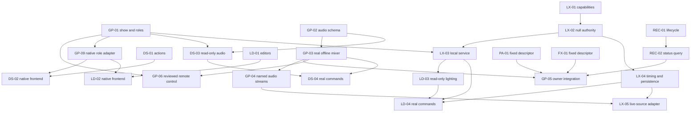

> Historical snapshot, retired as an active tracker. Relative links were
> adjusted for relocation; source text and dated evidence retain their original scope.

# Module implementation map

Planning checkpoint **2026-10-04, GP-2026-10-04.1**. Twelve owning plans are written;
the original planning inventory is retained below. Implementation is now active;
see the execution checkpoint at the end. The [previous execution checkpoint](../module-implementation-map-before-modules-2026-10-04.md) is preserved. Begin with this index, [contracts](../../reference/MODULE_CONTRACTS.md)
and [parallel launch cards](PARALLEL_WORK_PLAN.md). Product ownership remains
[COMPONENTS.md](../../architecture/COMPONENTS.md); this map records executable increments, not another
product architecture. Source evidence was checked against actual code and owner docs.

GigPies is the complete system: manual audio and lighting consoles, with ASSIST/AUTO
as optional modes. Two 1920×1080 displays and two separately assigned controllers
are the intended Brain layout. Stagebox keeps essential audio, monitor paths,
protection and recording independent of lighting/Brain failures. Development host
roles do not decide the eventual Stagebox/Brain assignment.

## Owning plans and exact inspected baselines

A READY task is software-ready; source delivery, file ownership and build reservation
are still checked at launch. No row implies new hardware verification. All baseline
observations are dated, not an instruction to reset a checkout to an old revision.

| Repository / classification | Owning plan and first task | Inspected HEAD / caveat |
|---|---|---|
| `gigpies` — Core integration / mixer host | [Plan](MODULE_IMPLEMENTATION_PLAN.md); **GP-01** | `99eb0f08050a9a86039af9f1ba2a3541649ca7b6`; existing index edit and untracked planning prompt retained |
| `shr-desk` — Core audio surface | [Plan](https://github.com/PaolaShultz/shr-desk/blob/main/docs/GIGPIES_IMPLEMENTATION.md); **DS-01** | `UNBORN; 25 original untracked source/doc files`; hash-manifest handoff required |
| `shr-lightdesk` — Core lighting surface | [Plan](https://github.com/PaolaShultz/shr-lightdesk/blob/main/docs/GIGPIES_IMPLEMENTATION.md); **LD-01** | `94402b42aae434a158657b7de9a73f013e27e352`; clean before plan writes |
| `shr-lux` — Core lighting engine | [Plan](https://github.com/PaolaShultz/shr-lux/blob/main/docs/notes/0027-gigpies-implementation.md); **LX-01** | `ba4ccd92656e6d2a3cbc6424cdc2a017d3e4f14d`; clean before plan writes |
| `shr-rec` — Core local recorder | [Plan](https://github.com/PaolaShultz/shr-rec/blob/main/docs/GIGPIES_IMPLEMENTATION.md); **REC-01** | `c0416d286eef2a455201dce4e992d9b3f6418f52`; clean before plan writes |
| `shr-fx` — Core wet-effects module | [Plan](https://github.com/PaolaShultz/shr-fx/blob/main/docs/GIGPIES_IMPLEMENTATION.md); **FX-01** | `cd943c6a5cbe3c06be4e9968f54f685e97baf84f`; clean before plan writes |
| `shr-pa` — Core speaker processor | [Plan](https://github.com/PaolaShultz/shr-pa/blob/main/docs/GIGPIES_IMPLEMENTATION.md); **PA-01** | `7683f9b38e2452e904468be3b90306ea450618ee`; clean before plan writes |
| `shr-daw` — Reference only | [Plan](https://github.com/PaolaShultz/shr-daw/blob/main/docs/GIGPIES_IMPLEMENTATION.md); **NONE (DEFERRED)** | `d93447d1ae391e7910c54965f886ed39baedab1c`; clean before plan writes |
| `shr-drums` — Optional source; DEFERRED | [Plan](https://github.com/PaolaShultz/shr-drums/blob/main/docs/plans/GIGPIES_IMPLEMENTATION.md); **NONE (DEFERRED)** | `f4a9a6a09e33f48aba11d77b9089cea03ec08460`; clean before plan writes |
| `shr-synth` — Optional source; DEFERRED | [Plan](https://github.com/PaolaShultz/shr-synth/blob/main/docs/superpowers/plans/2026-10-04-gigpies-integration.md); **NONE (DEFERRED)** | `818c94964334e9db183d136397b43d6461884f83`; clean before plan writes |
| `shr-sampler` — Optional source; DEFERRED | [Plan](https://github.com/PaolaShultz/shr-sampler/blob/main/docs/plans/GIGPIES_IMPLEMENTATION.md); **NONE (DEFERRED)** | `3aaabd50288a54e851618e1c464429a0dbab73eb`; clean before plan writes |
| `shr-tone-over-9000` — Optional source; DEFERRED | [Plan](https://github.com/PaolaShultz/shr-tone-over-9000/blob/main/docs/plans/GIGPIES_IMPLEMENTATION.md); **NONE (DEFERRED)** | `3fec963b88777278413412625fe7cf09b8c77bef`; clean before plan writes |

Each plan records source symbols, owning docs, implemented/mock/missing behavior,
ordered tasks, exact provider contracts, normal/optional test commands, failure
cases, resource class and its implementation prompt. Plans link from each owner's
current index/status/plan. Lux uses next notebook note **0027**, preserving its
numbered convention; Synth uses its existing superpowers/plans convention. Broader
blueprints, original idea documents and historical evidence were retained unchanged
apart from small discovery pointers; no owning draft was replaced.

The Desk baseline is an uncommitted independently buildable project, not an empty
repository to recreate. Its initial file-manifest SHA-256 is
`3d6be3b9d32f26a0c3da36b4117132523b3f4612b181a0b2571bde43b8620258`.
The exact peer source-and-plan snapshot carries its own full file hashes, including
these plans. A synthetic clone baseline is not an upstream commit.

## Inventory conclusions

| Module group | Actual evidence and boundary |
|---|---|
| GigPies | Offline f64 renderer and GPA1/control prototype plus integrated stereo PA/FX/REC host. The GPC1 scalar is not a mixer API; live multichannel graph/roles/show contract remain planned. |
| Desk / Lightdesk | Independently buildable surface simulators, controller primitives and SVG layouts; neither native window nor production engine adapter. They can implement focus/actions independently now. |
| Lux | Recorded four-source analysis, direction and pad previews; pure uDMX encoding. Fixture/programmer/cue authority, timing, persistence and physical DMX remain missing. Null-output authority is the first engine milestone. |
| PA | Full 2×6 standalone DSP with prepared controls; fixed-v1 full-range embedding only. Configurable embedding and phase measurement remain owner work. No complete band mixer here. |
| FX | Two standalone wet racks exist; embedded f64 ABI exposes one fixed delay. Descriptor must not advertise rack functionality through fixed v1. |
| REC | Bounded raw PCM24/recovery worker integrated in bench; shell capture/player unwired. Operation identity and written-progress query are useful next integration work. |
| DAW | Actual consumer of Git-pinned Drums and managed Synth/Sampler. It is a reference for GigPies, not a new mandatory host or mixed ownership of its mixer. |
| Drums / Synth / Sampler / Tone | Working separate engines/hosts with their own contracts. No immediate GigPies consumer; each has a small activation plan and no invented first-wave implementation. |

No currently required supporting-runtime library was discovered beyond the core
modules and their existing locked dependencies. Existing intra-repository workspace
paths are not sibling path dependencies. Rust 1.97.1 is selected explicitly;
Drums has no toolchain pin and some reference/optional repos retain edition 2021.
This documentation pass does not change their versions or editions.

Excluded from product-engine plans: `waves` is the private shared media library;
`shr-skills` is development workflow material; `gigpies-exchange` and the ignored
node-lab hub are development coordination, not runtime transport; legacy aliases
are not separate modules; nested Tone3000/NAM vendor references belong to Tone and
are not new GigPies engines. `go` is a standalone gadget launcher, outside the
COMPONENTS runtime map and not required to start either desk. No private media,
credential tree, build cache or whole workspace is a source handoff.

## Dependency order

Wave 1 has four independent roots: GP-01, LX-01, DS-01 and LD-01. GP-02, REC-01,
PA-01 and FX-01 are additional READY tasks for later freed lanes; they are not
extra concurrent owners of the initial checkouts. Native UI is independent of
physical drivers; read-only fixture consumer work starts when provider data lands,
while actual engine commands wait for the authoritative engine. PA-02/FX-02 design
reviews precede configurable/writable integration. No first-wave dependency cycle.

After bounded root reviews: GP-02/03 and LX-02/03, REC-01/02 and fixed module
descriptors; then read-only surface adapters; then real software control and
recording; then source subscriptions, timed lighting and persistence; then broader
channel/monitor/PFL/scene features. Full standalone recorder playback, optional
instrument hosts and cross-system cues do not gate a manual band console.

## Contract decisions, unresolved gates and ownership

[MODULE_CONTRACTS.md](../../reference/MODULE_CONTRACTS.md) is the coordinated definition registry.
C-SHOW/ROLE/AUDIO/ANALYSIS belong to GigPies; C-LIGHT belongs to Lux; recorder,
PA and FX owner ABIs remain authoritative. E01–E10 are shared semantic acceptance
examples. Actual fixture files are provider implementation tasks, not generated
in this documentation pass. One owner reviews contract changes before consumer
work; no worker invents the other endpoint or copies engine authority into a UI.

Unresolved design gates: B-NET (production remote authentication/framing, GP-06),
B-PA (prepared configurable ABI, PA-02), B-FX (minimal writable f64 ABI, FX-02).
These have named owner review tasks and do not block wave 1. B-FIXTURE and B-DEVICE
require actual equipment/role facts only when physical acceptance is scheduled.
No user answer is needed for the first software tasks. C-CUE remains deferred.

Separate physical gates: qualified stereo/clock/right-route continuation and
multichannel audio; native dual displays/controller identity/LED exclusivity;
known fixture encoding/output/loss/rearm; NVMe/multichannel recording; acoustics;
and finally reserved combined load, thermal/deadline and manual-show operation.
Compilation, headless mocks and descriptor/ACK success cannot pass those gates.

## Validation and preservation

The planning session checks documentation paths/anchors, whitespace, task and
contract references, acyclic initial dependencies, source preservation and the
complete existing publication index. Fresh production/historical/hardware/load
suites are intentionally skipped: runtime code, manifests and lockfiles did not
change. Recorded owner test results are evidence reviewed, not tests rerun now.
See the private task-0006 handoff record for exact checks and source delivery hashes.

Only new Markdown plans and minimal discovery/precedence links changed in owning
repositories. GigPies' pre-existing index edit and planning prompt are preserved;
Desk remains without a source HEAD. No public push, source commit, version bump,
implementation worker or physical operation. Private ledger delivery/acknowledgment
is distinct from committing or publishing product repositories.

## Execution checkpoint — 2026-10-04

The integrated software milestone is implemented and independently reviewed in
its owning repositories. The original inventory/task cards above retain their
planning baseline; this section records the current state.

| Owner | Accepted software foundation | Next separate increment |
|---|---|---|
| GigPies | GP-01..05, GP-09 and private local GP-06 subset; real owner graph, named analysis and role broker | Reviewed production remote authentication (B-NET), wider GP-07 scenes/channels; separately authorized physical/combined-load gates |
| SHR Desk | DS-01..04 including native software frontend; read-only DS-05 actual module health | Physical dual-display/controller/LED acceptance (GP-H2); later writable controls only after owner contracts |
| SHR Lightdesk | LD-01..04 including native software frontend and read-only LX05 compatibility | Physical role/display/controller acceptance; later analysis controls only as an explicit increment |
| SHR Lux | LX-01..05 null-output authority, release/recovery and named source automation | LX-06 fixture output only with known patch, explicit arming and hardware reservation |
| SHR REC / FX / PA | REC-01/02 and fixed-v1 FX-01/PA-01 implemented in their owners and consumed by GP-05 | Writable extensions/acoustic acceptance remain owner work; no duplicate algorithms in GigPies |

The graph uses the actual independently built REC/FX/PA libraries and their exact
versioned descriptors. Eight raw input stems remain separate from stereo FOH wet/dry
processing and the PA logical main path. Monitor sends retain GP03 behavior. No
provider algorithms or sibling path dependencies are copied into the consoles.
The bounded processing path has no allocations, locks or I/O; lifecycle preparation,
finalization and status queries execute outside it. Recorder durability remains unknown.

Named analysis carries oldest acquisition time and exact input/map/epoch identity.
Stale or lost input invalidates readiness, revokes automatic grants and preserves
the current lighting contribution. Human programmer/Hold values remain authoritative.
Retained contributions preserve their original provenance across source reattachment.
Lux restart restores intended looks/master/blackout disarmed under a new epoch,
without playback, grants, previews or uncertain-command replay.

Both consoles use accepted provider data and real executables. Native software
checks include bounded queues, successful-presentation confirmation gates,
resize/loss recovery, GP09 live-lease loss and CPU rendering. Desk obtains module
health on a separate read-only connection. Lightdesk's LX05 extension is read-only.
Calibration and AUTO grant controls remain owner protocol operations.

| Owner | Complete normal software checks | Additional acceptance |
|---|---|---|
| GigPies | 278 default Rust; 301 with `hardware-host`; 39 Python | GP09 process recovery, exact GP04 PCM/age/loss, four actual GP05 library/socket regressions and release lifecycle |
| SHR Desk | 97 default Rust; 99 with `native`; 9 publication checks | Real provider/role loss, independent module health, protected actions and CPU offscreen frames |
| SHR Lightdesk | 104 default Rust; 105 with `native`; 9 publication checks | Actual Lux/GP09 clients, complete reviews and LX05 analysis/provenance rendering |
| SHR Lux | 103 Rust; 8 terminal checks; 6 simulation checks | Actual GP04 analysis, calibration/AUTO/loss and durable null-output restart |
| SHR REC | 30 Rust | Exact PCM24 C harness, lifecycle/observer behavior and terminal checks |
| SHR FX | 105 Rust | Versioned ABI C harness at six sample rates; fixed-delay behavior |
| SHR PA | 70 Rust; 5 Python; 8 terminal checks | Descriptor/status C harness, null-output and synthetic offline processing |

Formatting, warnings-denied Clippy and release builds passed for the changed runtime
owners, including both frontend feature configurations and the device-free host.
The five optional/reference owners received reviewed documentation only.

The combined actual-executable demonstration passed with the accepted GP09 role
broker, GigPies/Desk/Lux/Lightdesk and all three owner libraries. Desk changed FOH
and its independent monitor send; Lux received and calibrated actual named PCM,
applied a bounded AUTO contribution and preserved a human Hold. Lightdesk completed
a reviewed release and checkpoint. Killing the owned Lux child left audio control
and recording working; restart restored the intended Hold/master/blackout under a
new epoch, disarmed and without replay.

Recorder start/retry/stop/finalization passed. All eight raw PCM24 stems matched
every expected source sample: **303,744 frames per stem**, with equal accepted
and written counts and unknown durability. Actual FX/PA descriptors and library
hashes were checked; separate graph tests verify the wet/dry samples into the PA
reference. Every owned child joined before temporary recordings/endpoints were
removed. This demonstrates bounded software behavior, not physical or load safety.

Full normal suites protect current production, schema, safety, recovery and shared
render/control behavior. Matching native and device-free host feature checks ran.
Actual provider/library and CPU-render checks were explicitly invoked. Historical
media, auditions, exhaustive matrices, long benchmarks, physical endpoints and
combined-load experiments were intentionally skipped. No download, playback,
operator window, service installation, version bump, tag or binary release was
part of this milestone. Source publication preserves private evidence outside Git.

The twelve owning plans and scoped prior-thread work are published in their owners.
Desk and Lightdesk are public repositories. Optional/reference DAW, Drums, Synth,
Sampler and Tone received planning/index changes only; no new runtime project was
activated. [Local session instructions and evidence](../../guides/HEADLESS_INTEGRATION.md) give
reproduction and the limits of these checks.

## Historical three-band checkpoint — 2026-10-05

GP-07's first slice is implemented and software-accepted: all eight mono FOH
inputs have prepared three-band EQ and compression, using existing GigPies DSP.
[The accepted contract](../../reference/CHANNEL_PROCESSING.md) owns neutral defaults, units,
48-frame application, 240-frame crossfades, manual FOH authority and truthful
current/target/readiness/GR. Desk uses the real versioned provider envelope and
existing semantic actions for keyboard and injected-controller edits, protected
confirmation, cancellation and reconnect.

The actual operator/provider/sample chain passed with independent per-input
mapping references, exact raw PCM24 recording and analysis, unchanged monitors,
and actual FX→PA order. REC covered the complete editing interval; settings and
revision remained stable after reconnect and lease expiry. Provider/consumer
schema, authority and frontend polling repairs were independently reviewed.

Complete GigPies normal suites passed (297 default, 320 `hardware-host`), alongside
39 Python checks, formatting, warnings-denied Clippy and release builds. Four
actual-owner GP05 regressions passed in addition to the joint GP07 acceptance.
Historical media/research matrices and physical/shared-load checks were skipped.

GP-07 remains partial: scenes, PFL, routing/channel expansion, writable PA/FX and
production remote authentication retain their separate gates. Source publication
and two-Pi synchronization do not deploy a service or establish hardware quality.

## Four-band parametric EQ correction — task0013

The accepted [processing v2 contract](../../reference/CHANNEL_PROCESSING.md) gives each of four
stable bands independent frequency, gain, Q and bypass on every mono input.
It preserves the compressor, FOH authority, shared retry history, raw recording
and analysis, and independent monitor sends. Valid legacy processing requests
receive an explicit unsupported-version refusal; GP03 remains compatible.
Actual operator/provider/sample acceptance passed with 17 edits, independent
bell references, unchanged raw/monitor paths and actual owner FX/PA order.
Actual CPU native channel/review rendering passes exact pixel comparisons at
1920×1080, 960×540, 540×960 and 3840×2160, plus zero-size suspension.
These checks establish software acceptance only; physical and combined-load gates
remain separate.

## Configurable composition successor

The current implementation seams are `topology`/`clock_domain`, the evolved
`mixer`/`mixer_control`, `structural_control`/`local_audio`, actual owner loading in
`module_graph`/`host::pa_v2`/`host::brain_fx`, and authenticated `remote` workers.
`host::duplex` feeds this same graph from an explicitly accepted raw device;
`gigpies-remote` provides a finite synthetic host. SHR Desk consumes explicit
successor schemas, including paged snapshots, and owns operator presentation.
See [composition](../../reference/MODULAR_PROCESSING.md) and [acceptance](../../acceptance/MODULAR_ENGINE_ACCEPTANCE.md).
