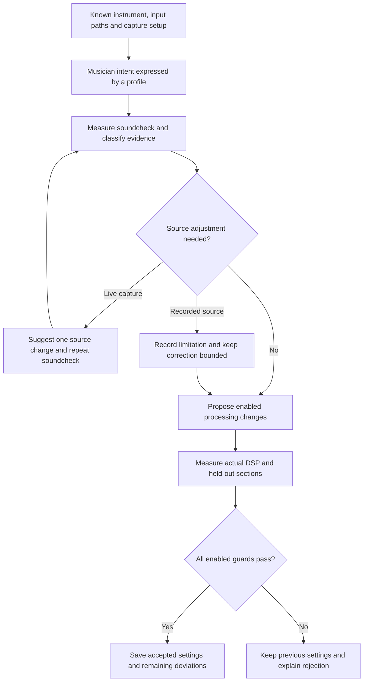

# Source rules and soundcheck advice

Implemented offline: an explicit profile supplies the intended numerical limits,
a known instrument/setup supplies applicability, and individual rules detect
measured deviations. The coordinator proposes one bounded correction bundle and
accepts it only after actual DSP and held-out checks. Source advice can stop that
bundle before automatic processing changes.

This is the beginning of a small expert system, not a finished catalogue of styles.
Names such as normal, dark, powerful or reggae do not have built-in meanings here.
We will define and test profiles instrument by instrument. The older `tone-pass`
named examples remain readable for compatibility; `source-pass` requires explicit
numerical profiles. A profile's display name never selects settings.

The [source-preservation review](SOURCE_PRESERVATION.md) makes unchanged sources
and ensembles eligible. Profiles are explicit experiments; measured deviations
from them do not establish a defective recording or preferred musical balance.

## Flow



The current implementation reads local recordings and writes JSON/settings, with
optional offline rendering. The live capture loop, musician web page, QR stations
and monitor controls remain planned. No command sends a message to a player,
changes hardware gain, controls an amplifier or starts playback.

## Commands and profile

```sh
cargo build --locked --release
target/release/gigpies source-analyze prepared.json sources new-review source-policy.json
target/release/gigpies source-pass prepared.json sources new-result source-policy.json
```

Both commands analyze, propose and validate. Only `source-pass` renders. Outputs
must be new directories. The [tone pass's input contract](TONE_PASS.md) still
applies: unity trims, preserved native rate/timing/pan, linked stereo processing,
explicit channel/master HPFs including bypass, effects disabled and unmatched −0.01 dBFS sample-peak
finalization. Neither faders nor compressor makeup are changed by these rules.

Example policy, with **temporary laboratory values**, not a manufacturer preset or
an approved style definition:

```json
{
  "instruments": [{
    "name": "guitar station",
    "primary": 8,
    "primary_file": "10_ElecGtr1.wav",
    "secondary": [9],
    "secondary_files": ["11_ElecGtr2.wav"],
    "capture": "amplifier_microphone",
    "profile": {
      "name": "guitar laboratory profile",
      "family": "electric_guitar",
      "capture": "amplifier_microphone",
      "body_presence_db": [-2, 4],
      "dynamics": {
        "max_mean_reduction_db": 3,
        "max_p95_reduction_db": 6,
        "max_threshold_raise_db": 12,
        "max_output_rise_db": 3
      },
      "source_first": {
        "eq_change_for_recheck_db": 4,
        "body_deviation_for_recheck_db": 6
      }
    }
  }]
}
```

Implemented families are `electric_guitar` and `acoustic_guitar`; they must match
the known channel role. Capture must match in the station and profile. Supported
capture contexts are `amplifier_microphone`, `direct_input`, `acoustic_microphone`
and `recorded_track`. Use the last for historical recordings whose physical chain
is unverified; it does not identify a microphone. Other instrument families need
their own validated rules before being added.

Setting `body_presence_db` or `dynamics` to `null` disables that correction family.
Disabled rules do not rewrite those parameters. Existing EQ is retained; if a new
curve needs more than the engine's eight slots, diagnosis remains available but the
bundle is blocked. Do not delete a player's settings silently to make room.

## Implemented detectors and corrections

### Body/presence deviation

Uses the [existing guitar measurement/search](TONE_PASS.md), now with the profile's
explicit range. Training consistency, minimum evidence, sparse-spectrum exclusion,
coherent microphone summing and section guards still apply. The
[temporal revision](TONE_DECAY.md) separates fading spectral balance from steady
tone and retains actual level/compression/crest checks on the excluded fade. A confident deviation
is distinct from an available repair: an EQ budget or source action can prevent a
change even when the detector has enough evidence.

### Sustained excessive compressor action

Uses the primary path's actual linked compressor envelopes. This is a processing
fault relative to the selected profile, not a claim that a guitar was badly played
or recorded. Deliberately heavy compression can have wider limits in its profile.

- Reuse native 8192-sample windows and alternating training/held-out sections;
  exclude windows crossing section boundaries. Dynamics activity uses raw primary
  level and the raw primary/secondary energy relationship. Secondary raw powers
  are summed without cancellation; compressor action and faders cannot conceal
  the input relationship. It does not require a
  broad spectrum, so sustained notes remain measurable.
- Require at least three windows and the policy's minimum active duration in
  training. A median mean-reduction or p95 window-maximum excess of at least
  0.5 dB is needed. At least the configured consistency fraction (default 70%) of
  training windows must exceed a mean or peak-action limit. An occasional high
  peak does not by itself trigger this sustained-action rule.
- Estimate threshold relief from excess and the compressor's static slope
  `1 - 1/ratio`. Round the request up to 0.5 dB; round allowed bounds down. Bound
  it by the profile's threshold budget, predicted output-rise budget and 0 dBFS
  threshold ceiling. This estimate only proposes a change; it is not a claim to
  predict time-varying gain reduction exactly.
- Keep attack, release, ratio, knee, makeup, trims and faders unchanged. There is
  no second makeup calculation, source normalization or loudness matching.
- Re-measure the complete candidate through production DSP. Actual excess must
  improve in both splits, or remain compliant in an already-compliant split.
  Median output rise cannot exceed the profile budget plus 0.05 dB numerical
  tolerance. Split median/p10 crest cannot fall beyond the existing crest guard.
  Individual sections also have output-rise limits, and no eligible window may
  acquire excessive additional compressor action.

Threshold relief may raise the source's contribution to the band mix. The level
budget limits that tradeoff; it does not prove preferred musical balance. If the
budget prevents full relief, the report retains the remaining deviation.

### Repeated PCM full-scale contact

At least three eligible training windows with 0.1% or more input samples touching
PCM full scale block the repair bundle. Repeated held-out contact also vetoes it.
This can indicate an input/recording problem, but does not identify where it happened
or prove the waveform can be recovered. The system requests an input-path review
instead of claiming to repair missing detail with EQ.

Floating-point input is explicitly **not applicable** to this PCM detector: valid
float headroom can exceed unity. Clipping recorded below full scale, analog clipping
and arbitrary distortion are not detected by this rule. Passing it does not certify
source quality.

## Adjust the source first

With adequate training confidence, either a proposed EQ band at least 4 dB in
magnitude or a body-range deviation at least 6 dB requests source review by default.
These operational thresholds are editable in `source_first`; they are not laws of
acoustics. Both boosting and cutting can trigger review.

For a known amplifier microphone, the report asks the musician to:

1. Compare the amp heard at the player's position with the primary mic signal.
2. If the amp itself is lean, add a little bass/low-mid. If the amp sounds right,
   try a small mic-position change first. For excess body, use the corresponding
   small reduction or placement check.
3. Change one thing, then repeat the same quiet, normal and strong phrases.

The sound at the player's position and the captured signal are different evidence.
The report does not infer cone position, proximity effect, microphone directivity,
room contribution or faulty hardware from a spectral ratio. `suspected_physical_cause`
is deliberately unset. These are controlled source-check suggestions, not a claimed
physical diagnosis or a prescribed knob amount on an unknown amp.

A DI gets instrument pickup/tone and input-routing advice, not amp instructions.
An acoustic mic gets instrument-versus-mic and placement/distance advice. A historical
recording gets a limitation report and may still receive a bounded, validated
software improvement. Repeated PCM full-scale contact blocks both contexts and asks
for an input-path check or a better original.

When live-capture advice requests a repeat, the current offline decision keeps the
previous processing. A subsequent run must measure the new capture against the
saved baseline; do not stack corrections from the old attempt. In the future live
workflow, monitor controls stay usable while automatic source preparation waits.
This does not require a new consent screen for each routine soundcheck step.

## Rule interaction and evidence

Body EQ and threshold relief are selected from the same original training data.
The combined candidate is measured once. Enabled rules are checked even when they
did not propose a change, so solving tone cannot silently violate the compressor
profile and vice versa. Reject the entire candidate if a guard fails; there is no
held-out retry, fallback search or optimization against a produced reference.
A source-action request, input-contact veto or unavailable EQ capacity prevents
candidate measurement/application and is reported separately.

`decisions.json` contains:

- Profile, known identity, detector states and empirical consistency (not probability).
- Separate plans, original/candidate/applied settings and whether the candidate was
  actually measured. Validation is null when a prior gate blocked it.
- Source advice, requested steps, repeat-soundcheck status and applicability.
- Actual applied metrics and independent `body_target_met` / `dynamics_target_met`
  values. Null means disabled or insufficient evidence; an accepted partial
  correction can still leave a target false.
- An unset listener-preference field and the level/masking tradeoffs.

Per-instrument files preserve original/candidate windows and separate body/dynamics
activity masks. `settings.json` contains only accepted changes. Media and detailed
private evidence stay ignored; output audio is never published with code.

## Validation and next work

Normal synthetic tests cover actual compressor relief, linked stereo rendering,
output/crest limits, quiet playing, silence, isolated peaks, source preservation,
profile applicability, disabled rules, arbitrary display names, combined-rule
acceptance/rejection, full-scale contact, float headroom, held-out independence,
EQ-capacity abstention and setup-specific source advice. Tone tests additionally
cover correlated microphones, sparse musical decays, transient guards and section
regressions. Historical private-media tests stay opt-in.

Future detector families include unwanted narrow resonances, noise/bleed, broader
spectral problems and attack/sustain problems. Their presence is not assumed in
these recordings. Style names and instrument-specific rule sets are future design
work, not a preset taxonomy implied by earlier examples. Full-band and monitor
context, measurement-driven speaker calibration and the live QR flow also remain
separate work. No console emulation or hardware validation is claimed.

## DI bass and kick extension

The [bass/kick rule](BASS_KICK.md) adds explicit DI identity, stage-separated evidence,
confidence-limited pitch analysis, bounded static EQ, actual transient checks and
separate fader assessment through `bass-analyze` / `bass-correct`. It uses its own
instrument-specific policy rather than applying guitar body/presence limits to bass.
Both rule families share the repeated PCM-contact thresholds; isolated events remain
reported with their source limitations. The Complainiacs trial changes only bass EQ
and retains the accepted guitar correction.

## Kick/snare evidence and explicit rhythmic balance

The [drum extension](DRUMS.md) separates source/EQ/compressor/makeup/routing evidence,
static-EQ sensitivity, recovery-conditioned relief and the musician's processed-output
rhythmic preference. Reduction maxima and band overlap cannot independently trigger
correction. A documented neutral basis is required for an automatic artistic offset;
unknown intent abstains. Actual processing/fader/combined outcomes and pending
listener preference remain separate. General drum tone-target selection is still
unimplemented; measured EQ probes can remain unselected when fault evidence is weak.

The [confirmed-snare-bleed investigation](SNARE_BLEED.md) adds conditional event
features and frozen reference-prediction probes. It distinguishes a detector defect
from a valid processing veto and insufficient source identity. Listener-confirmed
bleed is never negated by an empty automatic spill class. Quiet snare-like and
compound events stay protected; correlation alone does not authorize subtraction.

The [temporal follow-up](../archive/studies/SNARE_BLEED.md#temporal-follow-up-frozen-representation-audit)
keeps missing isolated-decay references distinct from valid processing failures.
Frozen representation distance never supplies a source label. Drum recovery now
ends at the next cluster's earliest retained rise, protecting quiet precursors
as well as the selected strongest peaks.

[Joint-reference diagnostics](../archive/studies/SNARE_BLEED.md#joint-kickoverhead-reference-experiment)
now distinguish a numerically stable fit from evidence supporting removal. They
retain quiet/compound and eventless-interval failures, freeze choices before full-song
evaluation, and always withhold processing without independent source labels.

## Historical evidence

The [dated study and original results](../archive/studies/SOURCE_RULES.md) retain experiment-specific settings and validation history.
